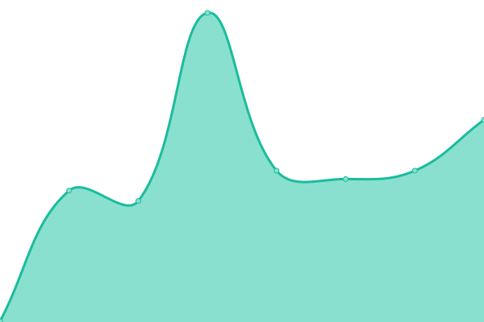
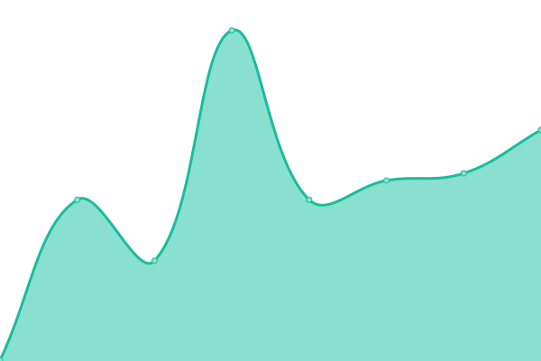

# [📈 Live Status](https://switch-software-solutions.github.io/status-page): <!--live status--> **🟩 All systems operational**

This repository contains the open-source uptime monitor and status page for [Switch Software Solutions](https://switchsoftware.us), powered by [Upptime](https://github.com/upptime/upptime).

With [Upptime](https://upptime.js.org), you can get your own unlimited and free uptime monitor and status page, powered entirely by a GitHub repository. We use [Issues](https://github.com/switch-software-solutions/status-page/issues) as incident reports, [Actions](https://github.com/switch-software-solutions/status-page/actions) as uptime monitors, and [Pages](https://switch-software-solutions.github.io/status-page) for the status page.

<!--start: status pages-->
<!-- This summary is generated by Upptime (https://github.com/upptime/upptime) -->
<!-- Do not edit this manually, your changes will be overwritten -->
<!-- prettier-ignore -->
| URL | Status | History | Response Time | Uptime |
| --- | ------ | ------- | ------------- | ------ |
|  [Pase Libre API](https://api.paselibre.uy/api/health/liveness) | 🟩 Up | [pase-libre-api.yml](https://github.com/Switch-Software-Solutions/status-page/commits/HEAD/history/pase-libre-api.yml) | 

 788ms
     
 | 

<a href="https://switch-software-solutions.github.io/status-page/history/pase-libre-api">100.00%</a>
    

|  [Pase Libre WebSite](https://paselibre.uy) | 🟩 Up | [pase-libre-web-site.yml](https://github.com/Switch-Software-Solutions/status-page/commits/HEAD/history/pase-libre-web-site.yml) | 

 783ms
     
 | 

<a href="https://switch-software-solutions.github.io/status-page/history/pase-libre-web-site">100.00%</a>
    

|  [SBI Institucional](https://sbi.uy) | 🟩 Up | [sbi-institucional.yml](https://github.com/Switch-Software-Solutions/status-page/commits/HEAD/history/sbi-institucional.yml) | 

 204ms
     
 | 

<a href="https://switch-software-solutions.github.io/status-page/history/sbi-institucional">100.00%</a>
    

|  [SBI Mi Auto](https://miauto.sbi.uy) | 🟩 Up | [sbi-mi-auto.yml](https://github.com/Switch-Software-Solutions/status-page/commits/HEAD/history/sbi-mi-auto.yml) | 

 305ms
     
 | 

<a href="https://switch-software-solutions.github.io/status-page/history/sbi-mi-auto">100.00%</a>
    

|  [SBI Mi Hogar](https://mihogar.sbi.uy) | 🟩 Up | [sbi-mi-hogar.yml](https://github.com/Switch-Software-Solutions/status-page/commits/HEAD/history/sbi-mi-hogar.yml) | 

 201ms
     
 | 

<a href="https://switch-software-solutions.github.io/status-page/history/sbi-mi-hogar">100.00%</a>
    

|  [SBI Backoffice](https://back.sbi.uy) | 🟩 Up | [sbi-backoffice.yml](https://github.com/Switch-Software-Solutions/status-page/commits/HEAD/history/sbi-backoffice.yml) | 

 253ms
     
 | 

<a href="https://switch-software-solutions.github.io/status-page/history/sbi-backoffice">100.00%</a>
    

|  [SBI Autogestion](https://autogestion.sbi.uy) | 🟩 Up | [sbi-autogestion.yml](https://github.com/Switch-Software-Solutions/status-page/commits/HEAD/history/sbi-autogestion.yml) | 

 110ms
     
 | 

<a href="https://switch-software-solutions.github.io/status-page/history/sbi-autogestion">100.00%</a>
    

|  [SBI Corredores](https://corredores.sbi.uy) | 🟩 Up | [sbi-corredores.yml](https://github.com/Switch-Software-Solutions/status-page/commits/HEAD/history/sbi-corredores.yml) | 

 194ms
     
 | 

<a href="https://switch-software-solutions.github.io/status-page/history/sbi-corredores">100.00%</a>
    

<!--end: status pages-->

[**Visit our status website →**](https://switch-software-solutions.github.io/status-page)

## 📄 License

- Powered by: [Upptime](https://github.com/upptime/upptime)
- Code: [MIT](./LICENSE) © [Switch Software Solutions](https://switchsoftware.us)
- Data in the `./history` directory: [Open Database License](https://opendatacommons.org/licenses/odbl/1-0/)
