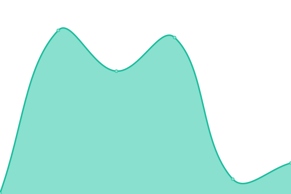

# [📈 Live Status](https://switch-software-solutions.github.io/status-page): <!--live status--> **🟩 All systems operational**

This repository contains the open-source uptime monitor and status page for [Switch Software Solutions](https://switchsoftware.us), powered by [Upptime](https://github.com/upptime/upptime).

With [Upptime](https://upptime.js.org), you can get your own unlimited and free uptime monitor and status page, powered entirely by a GitHub repository. We use [Issues](https://github.com/switch-software-solutions/status-page/issues) as incident reports, [Actions](https://github.com/switch-software-solutions/status-page/actions) as uptime monitors, and [Pages](https://switch-software-solutions.github.io/status-page) for the status page.

<!--start: status pages-->
<!-- This summary is generated by Upptime (https://github.com/upptime/upptime) -->
<!-- Do not edit this manually, your changes will be overwritten -->
<!-- prettier-ignore -->
| URL | Status | History | Response Time | Uptime |
| --- | ------ | ------- | ------------- | ------ |
|  [Pase Libre API](https://api.paselibre.uy/api/health/liveness) | 🟩 Up | [pase-libre-api.yml](https://github.com/Switch-Software-Solutions/status-page/commits/HEAD/history/pase-libre-api.yml) | 

 755ms
     
 | 

<a href="https://status.switchsoftware.us/history/pase-libre-api">100.00%</a>
    

|  [Pase Libre WebSite](https://paselibre.uy) | 🟩 Up | [pase-libre-web-site.yml](https://github.com/Switch-Software-Solutions/status-page/commits/HEAD/history/pase-libre-web-site.yml) | 

 721ms
     
 | 

<a href="https://status.switchsoftware.us/history/pase-libre-web-site">100.00%</a>
    

|  [SBI Institucional](https://sbi.uy) | 🟩 Up | [sbi-institucional.yml](https://github.com/Switch-Software-Solutions/status-page/commits/HEAD/history/sbi-institucional.yml) | 

 275ms
     
 | 

<a href="https://status.switchsoftware.us/history/sbi-institucional">98.35%</a>
    

|  [SBI Mi Auto](https://miauto.sbi.uy) | 🟩 Up | [sbi-mi-auto.yml](https://github.com/Switch-Software-Solutions/status-page/commits/HEAD/history/sbi-mi-auto.yml) | 

 530ms
     
 | 

<a href="https://status.switchsoftware.us/history/sbi-mi-auto">98.44%</a>
    

|  [SBI Mi Hogar](https://mihogar.sbi.uy) | 🟩 Up | [sbi-mi-hogar.yml](https://github.com/Switch-Software-Solutions/status-page/commits/HEAD/history/sbi-mi-hogar.yml) | 

 267ms
     
 | 

<a href="https://status.switchsoftware.us/history/sbi-mi-hogar">98.53%</a>
    

|  [SBI Backoffice](https://back.sbi.uy) | 🟩 Up | [sbi-backoffice.yml](https://github.com/Switch-Software-Solutions/status-page/commits/HEAD/history/sbi-backoffice.yml) | 

 226ms
     
 | 

<a href="https://status.switchsoftware.us/history/sbi-backoffice">98.61%</a>
    

|  [SBI Autogestion](https://autogestion.sbi.uy) | 🟩 Up | [sbi-autogestion.yml](https://github.com/Switch-Software-Solutions/status-page/commits/HEAD/history/sbi-autogestion.yml) | 

 248ms
     
 | 

<a href="https://status.switchsoftware.us/history/sbi-autogestion">100.00%</a>
    

|  [SBI Corredores](https://corredores.sbi.uy) | 🟩 Up | [sbi-corredores.yml](https://github.com/Switch-Software-Solutions/status-page/commits/HEAD/history/sbi-corredores.yml) | 

 230ms
     
 | 

<a href="https://status.switchsoftware.us/history/sbi-corredores">100.00%</a>
    

|  [The Real Scout](https://therealscout.com) | 🟩 Up | [the-real-scout.yml](https://github.com/Switch-Software-Solutions/status-page/commits/HEAD/history/the-real-scout.yml) | 

 192ms
     
 | 

<a href="https://status.switchsoftware.us/history/the-real-scout">100.00%</a>
    

|  [The Real Scout Backoffice](https://backoffice.therealscout.com) | 🟩 Up | [the-real-scout-backoffice.yml](https://github.com/Switch-Software-Solutions/status-page/commits/HEAD/history/the-real-scout-backoffice.yml) | 

 185ms
     
 | 

<a href="https://status.switchsoftware.us/history/the-real-scout-backoffice">100.00%</a>
    

|  [The Real Scout Gateway](https://gateway.therealscout.com/identity) | 🟩 Up | [the-real-scout-gateway.yml](https://github.com/Switch-Software-Solutions/status-page/commits/HEAD/history/the-real-scout-gateway.yml) | 

 177ms
     
 | 

<a href="https://status.switchsoftware.us/history/the-real-scout-gateway">100.00%</a>
    

|  [Cadynce Web Portal](https://cadynce-web-prod.azurewebsites.net) | 🟩 Up | [cadynce-web-portal.yml](https://github.com/Switch-Software-Solutions/status-page/commits/HEAD/history/cadynce-web-portal.yml) | 

 69ms
     
 | 

<a href="https://status.switchsoftware.us/history/cadynce-web-portal">100.00%</a>
    

|  [Cadynce Identity API](https://cadynce-api-identity-prod.azurewebsites.net/index.html) | 🟩 Up | [cadynce-identity-api.yml](https://github.com/Switch-Software-Solutions/status-page/commits/HEAD/history/cadynce-identity-api.yml) | 

 69ms
     
 | 

<a href="https://status.switchsoftware.us/history/cadynce-identity-api">100.00%</a>
    

|  [Cadynce Elements API](https://cadynce-api-elements-prod.azurewebsites.net/index.html) | 🟩 Up | [cadynce-elements-api.yml](https://github.com/Switch-Software-Solutions/status-page/commits/HEAD/history/cadynce-elements-api.yml) | 

 104ms
     
 | 

<a href="https://status.switchsoftware.us/history/cadynce-elements-api">100.00%</a>
    

|  [Cadynce Files API](https://cadynce-fileserver-prod.azurewebsites.net/index.html) | 🟩 Up | [cadynce-files-api.yml](https://github.com/Switch-Software-Solutions/status-page/commits/HEAD/history/cadynce-files-api.yml) | 

 106ms
     
 | 

<a href="https://status.switchsoftware.us/history/cadynce-files-api">100.00%</a>
    

|  [Cadynce Elements API](https://cadyncebpa-prod-api-management.azure-api.net) | 🟩 Up | [cadynce-elements-api.yml](https://github.com/Switch-Software-Solutions/status-page/commits/HEAD/history/cadynce-elements-api.yml) | 

 104ms
     
 | 

<a href="https://status.switchsoftware.us/history/cadynce-elements-api">100.00%</a>
    

|  [CEPI WebSite](http://web-cau-prod.switch.com.uy) | 🟩 Up | [cepi-web-site.yml](https://github.com/Switch-Software-Solutions/status-page/commits/HEAD/history/cepi-web-site.yml) | 

 557ms
     
 | 

<a href="https://status.switchsoftware.us/history/cepi-web-site">100.00%</a>
    

|  [CEPI Gateway](http://api-cau-prod.switch.com.uy/api/health/liveness) | 🟩 Up | [cepi-gateway.yml](https://github.com/Switch-Software-Solutions/status-page/commits/HEAD/history/cepi-gateway.yml) | 

 556ms
     
 | 

<a href="https://status.switchsoftware.us/history/cepi-gateway">100.00%</a>
    

<!--end: status pages-->

[**Visit our status website →**](https://switch-software-solutions.github.io/status-page)

## 📄 License

- Powered by: [Upptime](https://github.com/upptime/upptime)
- Code: [MIT](./LICENSE) © [Switch Software Solutions](https://switchsoftware.us)
- Data in the `./history` directory: [Open Database License](https://opendatacommons.org/licenses/odbl/1-0/)
