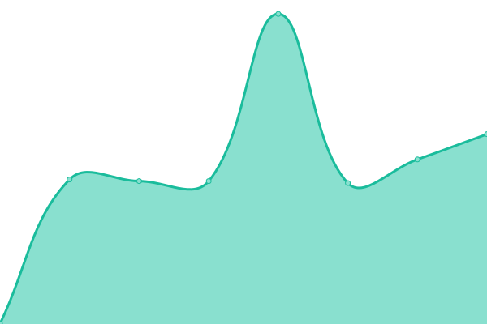

# [📈 Live Status](https://switch-software-solutions.github.io/status-page): <!--live status--> **🟩 All systems operational**

This repository contains the open-source uptime monitor and status page for [Switch Software Solutions](https://switchsoftware.us), powered by [Upptime](https://github.com/upptime/upptime).

With [Upptime](https://upptime.js.org), you can get your own unlimited and free uptime monitor and status page, powered entirely by a GitHub repository. We use [Issues](https://github.com/switch-software-solutions/status-page/issues) as incident reports, [Actions](https://github.com/switch-software-solutions/status-page/actions) as uptime monitors, and [Pages](https://switch-software-solutions.github.io/status-page) for the status page.

<!--start: status pages-->
<!-- This summary is generated by Upptime (https://github.com/upptime/upptime) -->
<!-- Do not edit this manually, your changes will be overwritten -->
<!-- prettier-ignore -->
| URL | Status | History | Response Time | Uptime |
| --- | ------ | ------- | ------------- | ------ |
|  [Paselibre WebSite](https://paselibre.uy) | 🟩 Up | [paselibre-web-site.yml](https://github.com/Switch-Software-Solutions/status-page/commits/HEAD/history/paselibre-web-site.yml) | 

 234ms
     
 | 

<a href="https://status.switchsoftware.us/history/paselibre-web-site">100.00%</a>
    

|  [Paselibre API](https://api.paselibre.uy/api/health/liveness) | 🟩 Up | [paselibre-api.yml](https://github.com/Switch-Software-Solutions/status-page/commits/HEAD/history/paselibre-api.yml) | 

 248ms
     
 | 

<a href="https://status.switchsoftware.us/history/paselibre-api">100.00%</a>
    

|  [Paselibre Gimnasios](https://gimnasio.paselibre.uy) | 🟩 Up | [paselibre-gimnasios.yml](https://github.com/Switch-Software-Solutions/status-page/commits/HEAD/history/paselibre-gimnasios.yml) | 

 217ms
     
 | 

<a href="https://status.switchsoftware.us/history/paselibre-gimnasios">100.00%</a>
    

|  [Paselibre Portal](https://portal.paselibre.uy) | 🟩 Up | [paselibre-portal.yml](https://github.com/Switch-Software-Solutions/status-page/commits/HEAD/history/paselibre-portal.yml) | 

 204ms
     
 | 

<a href="https://status.switchsoftware.us/history/paselibre-portal">100.00%</a>
    

|  [SBI Multiproducto](https://sbi.uy) | 🟩 Up | [sbi-multiproducto.yml](https://github.com/Switch-Software-Solutions/status-page/commits/HEAD/history/sbi-multiproducto.yml) | 

 802ms
     
 | 

<a href="https://status.switchsoftware.us/history/sbi-multiproducto">100.00%</a>
    

|  [SBI Mi Auto](https://miauto.sbi.uy) | 🟩 Up | [sbi-mi-auto.yml](https://github.com/Switch-Software-Solutions/status-page/commits/HEAD/history/sbi-mi-auto.yml) | 

 587ms
     
 | 

<a href="https://status.switchsoftware.us/history/sbi-mi-auto">100.00%</a>
    

|  [SBI Backoffice](https://back.sbi.uy) | 🟩 Up | [sbi-backoffice.yml](https://github.com/Switch-Software-Solutions/status-page/commits/HEAD/history/sbi-backoffice.yml) | 

 568ms
     
 | 

<a href="https://status.switchsoftware.us/history/sbi-backoffice">96.64%</a>
    

|  [SBI Autogestion](https://autogestion.sbi.uy) | 🟩 Up | [sbi-autogestion.yml](https://github.com/Switch-Software-Solutions/status-page/commits/HEAD/history/sbi-autogestion.yml) | 

 618ms
     
 | 

<a href="https://status.switchsoftware.us/history/sbi-autogestion">96.64%</a>
    

|  [SBI Corredores](https://corredores.sbi.uy) | 🟩 Up | [sbi-corredores.yml](https://github.com/Switch-Software-Solutions/status-page/commits/HEAD/history/sbi-corredores.yml) | 

 500ms
     
 | 

<a href="https://status.switchsoftware.us/history/sbi-corredores">100.00%</a>
    

|  [SBI Payments](https://payments.sbi.uy) | 🟩 Up | [sbi-payments.yml](https://github.com/Switch-Software-Solutions/status-page/commits/HEAD/history/sbi-payments.yml) | 

 613ms
     
 | 

<a href="https://status.switchsoftware.us/history/sbi-payments">96.64%</a>
    

|  [CEPI WebSite](http://web-cau-prod.switch.com.uy) | 🟩 Up | [cepi-web-site.yml](https://github.com/Switch-Software-Solutions/status-page/commits/HEAD/history/cepi-web-site.yml) | 

 783ms
     
 | 

<a href="https://status.switchsoftware.us/history/cepi-web-site">100.00%</a>
    

|  [CEPI Gateway](http://api-cau-prod.switch.com.uy/api/health/liveness) | 🟩 Up | [cepi-gateway.yml](https://github.com/Switch-Software-Solutions/status-page/commits/HEAD/history/cepi-gateway.yml) | 

 601ms
     
 | 

<a href="https://status.switchsoftware.us/history/cepi-gateway">100.00%</a>
    

|  [Logisyn Portal](https://logisyn.com) | 🟩 Up | [logisyn-portal.yml](https://github.com/Switch-Software-Solutions/status-page/commits/HEAD/history/logisyn-portal.yml) | 

 527ms
     
 | 

<a href="https://status.switchsoftware.us/history/logisyn-portal">99.92%</a>
    

|  [Logisyn Backoffice](https://backoffice.logisyn.com) | 🟩 Up | [logisyn-backoffice.yml](https://github.com/Switch-Software-Solutions/status-page/commits/HEAD/history/logisyn-backoffice.yml) | 

 328ms
     
 | 

<a href="https://status.switchsoftware.us/history/logisyn-backoffice">100.00%</a>
    

<!--end: status pages-->

[**Visit our status website →**](https://switch-software-solutions.github.io/status-page)

## 📄 License

- Powered by: [Upptime](https://github.com/upptime/upptime)
- Code: [MIT](./LICENSE) © [Switch Software Solutions](https://switchsoftware.us)
- Data in the `./history` directory: [Open Database License](https://opendatacommons.org/licenses/odbl/1-0/)
