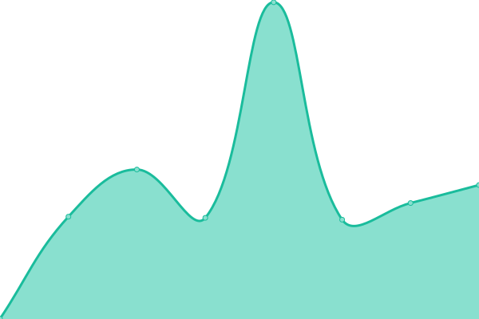

# [📈 Live Status](https://switch-software-solutions.github.io/status-page): <!--live status--> **🟩 All systems operational**

This repository contains the open-source uptime monitor and status page for [Switch Software Solutions](https://switchsoftware.us), powered by [Upptime](https://github.com/upptime/upptime).

With [Upptime](https://upptime.js.org), you can get your own unlimited and free uptime monitor and status page, powered entirely by a GitHub repository. We use [Issues](https://github.com/switch-software-solutions/status-page/issues) as incident reports, [Actions](https://github.com/switch-software-solutions/status-page/actions) as uptime monitors, and [Pages](https://switch-software-solutions.github.io/status-page) for the status page.

<!--start: status pages-->
<!-- This summary is generated by Upptime (https://github.com/upptime/upptime) -->
<!-- Do not edit this manually, your changes will be overwritten -->
<!-- prettier-ignore -->
| URL | Status | History | Response Time | Uptime |
| --- | ------ | ------- | ------------- | ------ |
|  [API](https://api.paselibre.uy/api/health/liveness) | 🟩 Up | [api.yml](https://github.com/Switch-Software-Solutions/status-page/commits/HEAD/history/api.yml) | 

 732ms
     
 | 

<a href="https://status.switchsoftware.us/history/api">100.00%</a>
    

|  [WebSite](https://paselibre.uy) | 🟩 Up | [web-site.yml](https://github.com/Switch-Software-Solutions/status-page/commits/HEAD/history/web-site.yml) | 

 713ms
     
 | 

<a href="https://status.switchsoftware.us/history/web-site">100.00%</a>
    

|  [Institucional](https://sbi.uy) | 🟩 Up | [institucional.yml](https://github.com/Switch-Software-Solutions/status-page/commits/HEAD/history/institucional.yml) | 

 330ms
     
 | 

<a href="https://status.switchsoftware.us/history/institucional">100.00%</a>
    

|  [Mi Auto](https://miauto.sbi.uy) | 🟩 Up | [mi-auto.yml](https://github.com/Switch-Software-Solutions/status-page/commits/HEAD/history/mi-auto.yml) | 

 376ms
     
 | 

<a href="https://status.switchsoftware.us/history/mi-auto">100.00%</a>
    

|  [Mi Hogar](https://mihogar.sbi.uy) | 🟩 Up | [mi-hogar.yml](https://github.com/Switch-Software-Solutions/status-page/commits/HEAD/history/mi-hogar.yml) | 

 323ms
     
 | 

<a href="https://status.switchsoftware.us/history/mi-hogar">100.00%</a>
    

|  [Backoffice](https://back.sbi.uy) | 🟩 Up | [backoffice.yml](https://github.com/Switch-Software-Solutions/status-page/commits/HEAD/history/backoffice.yml) | 

 294ms
     
 | 

<a href="https://status.switchsoftware.us/history/backoffice">100.00%</a>
    

|  [Autogestion](https://autogestion.sbi.uy) | 🟩 Up | [autogestion.yml](https://github.com/Switch-Software-Solutions/status-page/commits/HEAD/history/autogestion.yml) | 

 254ms
     
 | 

<a href="https://status.switchsoftware.us/history/autogestion">100.00%</a>
    

|  [Corredores](https://corredores.sbi.uy) | 🟩 Up | [corredores.yml](https://github.com/Switch-Software-Solutions/status-page/commits/HEAD/history/corredores.yml) | 

 296ms
     
 | 

<a href="https://status.switchsoftware.us/history/corredores">100.00%</a>
    

|  [Scouting Portal](https://therealscout.com) | 🟩 Up | [scouting-portal.yml](https://github.com/Switch-Software-Solutions/status-page/commits/HEAD/history/scouting-portal.yml) | 

 193ms
     
 | 

<a href="https://status.switchsoftware.us/history/scouting-portal">100.00%</a>
    

|  [Backoffice](https://backoffice.therealscout.com) | 🟩 Up | [backoffice.yml](https://github.com/Switch-Software-Solutions/status-page/commits/HEAD/history/backoffice.yml) | 

 294ms
     
 | 

<a href="https://status.switchsoftware.us/history/backoffice">100.00%</a>
    

|  [Gateway](https://gateway.therealscout.com/identity) | 🟩 Up | [gateway.yml](https://github.com/Switch-Software-Solutions/status-page/commits/HEAD/history/gateway.yml) | 

 232ms
     
 | 

<a href="https://status.switchsoftware.us/history/gateway">100.00%</a>
    

|  [Web Portal](https://cadynce-web-prod.azurewebsites.net) | 🟩 Up | [web-portal.yml](https://github.com/Switch-Software-Solutions/status-page/commits/HEAD/history/web-portal.yml) | 

 278ms
     
 | 

<a href="https://status.switchsoftware.us/history/web-portal">100.00%</a>
    

|  [Identity API](https://cadynce-api-identity-prod.azurewebsites.net/index.html) | 🟩 Up | [identity-api.yml](https://github.com/Switch-Software-Solutions/status-page/commits/HEAD/history/identity-api.yml) | 

 257ms
     
 | 

<a href="https://status.switchsoftware.us/history/identity-api">100.00%</a>
    

|  [Elements API](https://cadynce-api-elements-prod.azurewebsites.net/index.html) | 🟩 Up | [elements-api.yml](https://github.com/Switch-Software-Solutions/status-page/commits/HEAD/history/elements-api.yml) | 

 265ms
     
 | 

<a href="https://status.switchsoftware.us/history/elements-api">100.00%</a>
    

|  [Files API](https://cadynce-fileserver-prod.azurewebsites.net/index.html) | 🟩 Up | [files-api.yml](https://github.com/Switch-Software-Solutions/status-page/commits/HEAD/history/files-api.yml) | 

 254ms
     
 | 

<a href="https://status.switchsoftware.us/history/files-api">100.00%</a>
    

|  [Gateway](https://cadyncebpa-prod-api-management.azure-api.net) | 🟩 Up | [gateway.yml](https://github.com/Switch-Software-Solutions/status-page/commits/HEAD/history/gateway.yml) | 

 232ms
     
 | 

<a href="https://status.switchsoftware.us/history/gateway">100.00%</a>
    

|  [CEPI WebSite](http://web-cau-prod.switch.com.uy) | 🟩 Up | [cepi-web-site.yml](https://github.com/Switch-Software-Solutions/status-page/commits/HEAD/history/cepi-web-site.yml) | 

 598ms
     
 | 

<a href="https://status.switchsoftware.us/history/cepi-web-site">99.70%</a>
    

|  [CEPI Gateway](http://api-cau-prod.switch.com.uy/api/health/liveness) | 🟩 Up | [cepi-gateway.yml](https://github.com/Switch-Software-Solutions/status-page/commits/HEAD/history/cepi-gateway.yml) | 

 741ms
     
 | 

<a href="https://status.switchsoftware.us/history/cepi-gateway">99.71%</a>
    

|  [Portal](https://timeswan.com) | 🟩 Up | [portal.yml](https://github.com/Switch-Software-Solutions/status-page/commits/HEAD/history/portal.yml) | 

 250ms
     
 | 

<a href="https://status.switchsoftware.us/history/portal">100.00%</a>
    

|  [Portal](https://logisyn.com) | 🟩 Up | [portal.yml](https://github.com/Switch-Software-Solutions/status-page/commits/HEAD/history/portal.yml) | 

 250ms
     
 | 

<a href="https://status.switchsoftware.us/history/portal">100.00%</a>
    

|  [Backoffice](https://backoffice.logisyn.com) | 🟩 Up | [backoffice.yml](https://github.com/Switch-Software-Solutions/status-page/commits/HEAD/history/backoffice.yml) | 

 294ms
     
 | 

<a href="https://status.switchsoftware.us/history/backoffice">100.00%</a>
    

<!--end: status pages-->

[**Visit our status website →**](https://switch-software-solutions.github.io/status-page)

## 📄 License

- Powered by: [Upptime](https://github.com/upptime/upptime)
- Code: [MIT](./LICENSE) © [Switch Software Solutions](https://switchsoftware.us)
- Data in the `./history` directory: [Open Database License](https://opendatacommons.org/licenses/odbl/1-0/)
